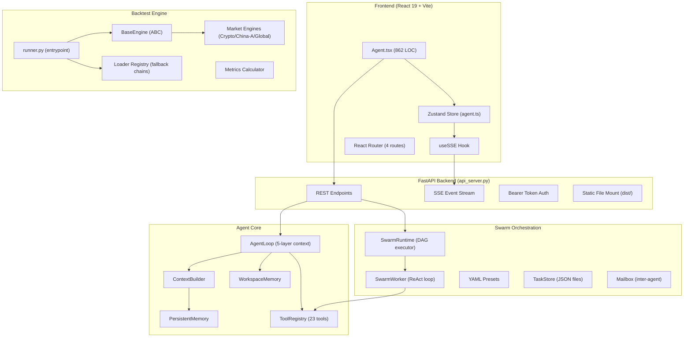
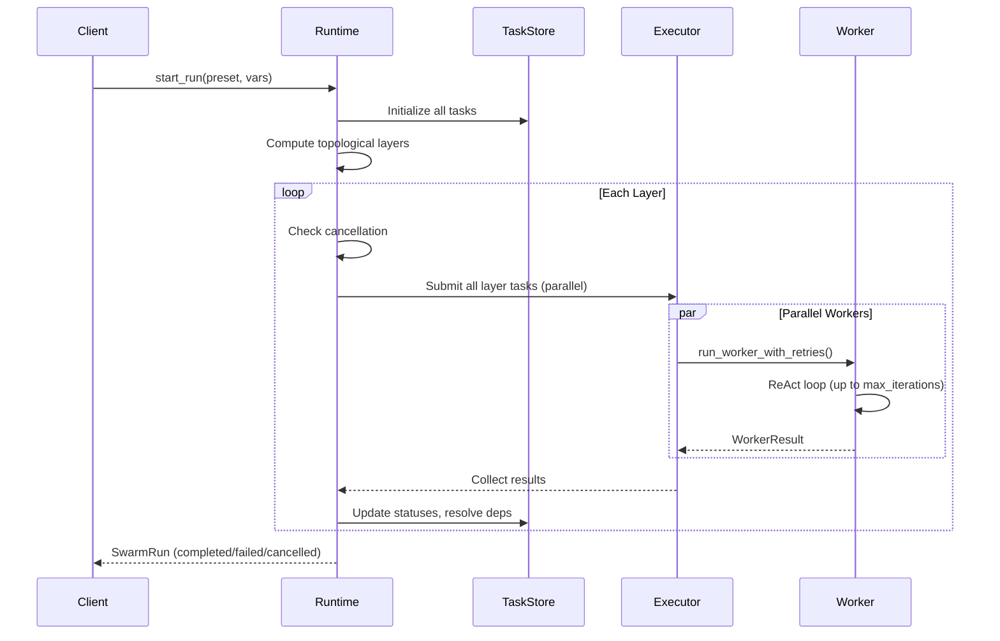
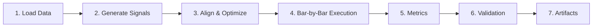
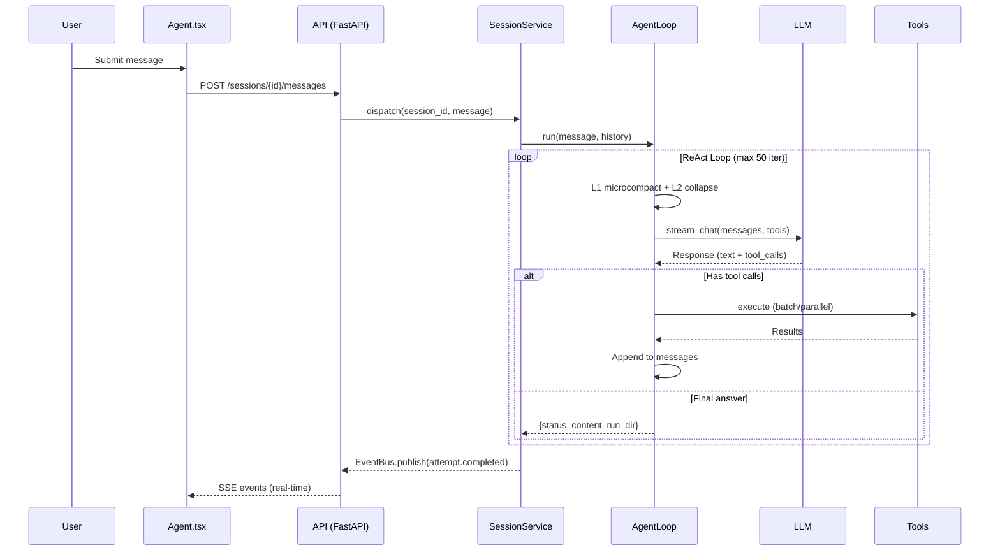
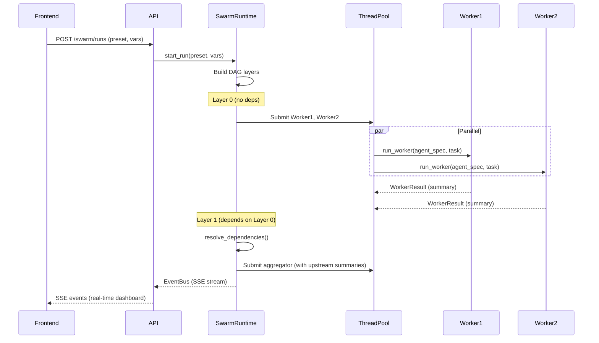

# Vibe-Trading — Comprehensive Architecture Audit

> **Audit Scope:** Full-project read-only audit covering backend agent infrastructure, swarm orchestration, backtest engines, persistent memory, frontend, and environment configuration.
> **Date:** 2026-04-26
> **Status:** ✅ Complete — No code changes made

---

## 1. System Architecture Overview



---

## 2. Core Component Analysis

### 2.1 Agent Loop ([loop.py](file:///c:/Users/Yeshw/OneDrive/Documents/GitHub/Vibe-Trading/agent/src/agent/loop.py))

**789 LOC** — The central ReAct execution engine. Key architectural decisions:

| Layer | Mechanism | Trigger | API Cost |
|-------|-----------|---------|----------|
| L1 — Microcompact | Prune old tool results (`[cleared]`) | Every iteration | Zero |
| L2 — Context Collapse | Head+tail folding of long text blocks | `tokens > 70% threshold` | Zero |
| L3 — Auto Compact | LLM-powered structured summary | `tokens > TOKEN_THRESHOLD (40K)` | 1 LLM call |
| L4 — Manual Compact | Model calls `compact` tool explicitly | Agent-initiated | 1 LLM call |
| L5 — Iterative Update | Updates previous summary instead of fresh | Nth compression | 1 LLM call |

**Key Design Details:**
- **Token-budget tail protection:** Preserves ~20K tokens of recent messages (walk backward from end), never splitting mid tool-pair
- **Read/write batching:** Consecutive readonly tools execute in parallel via `ThreadPoolExecutor(max_workers=8)`, write tools execute serially between batches
- **Duplicate suppression:** Non-repeatable tools that succeeded once are blocked from re-execution — returns cached skip message
- **Background task injection:** Drains `BackgroundManager` notifications each iteration, injecting results as synthetic user/assistant pairs
- **Transcript preservation:** Full message history is written to `transcript_{timestamp}.jsonl` before every compression

> [!NOTE]
> The `_fix_tool_pairs` function repairs orphaned tool_call/tool_result pairs after compression — inserting stub results for calls whose results were compressed away, and removing orphaned results whose calls were removed. This is critical for API compatibility with OpenAI-format message sequences.

---

### 2.2 Swarm Orchestration

#### Runtime ([runtime.py](file:///c:/Users/Yeshw/OneDrive/Documents/GitHub/Vibe-Trading/agent/src/swarm/runtime.py)) — 530 LOC

**DAG-based multi-agent orchestrator:**



**Production hardening:**
- **Layer-level deadline:** `layer_budget + 60s` buffer, defends against workers stuck in C extensions/blocked I/O
- **Graceful shutdown:** `executor.shutdown(wait=False, cancel_futures=True)` — running workers finish naturally, pending work drops
- **Automatic retry:** `max_retries` per agent spec (default 2), token counts accumulated across attempts
- **Cancellation:** `threading.Event` checked between layers; `_cancel_remaining_tasks` marks all incomplete tasks as cancelled
- **Token tracking:** Cumulative `input_tokens/output_tokens` tracked across all workers and attempts

#### Worker ([worker.py](file:///c:/Users/Yeshw/OneDrive/Documents/GitHub/Vibe-Trading/agent/src/swarm/worker.py)) — 445 LOC

Standalone lightweight ReAct loop (does NOT use `AgentLoop`):
- Uses `ChatLLM.stream_chat()` with live text chunk forwarding to dashboard
- **Microcompact:** Clears old tool results (keeping last 3) each iteration
- **Wrap-up nudge:** At 80% of iteration budget, injects system message forcing text output
- **Last iteration trick:** Calls LLM without tool definitions to guarantee text-only response
- **Token estimate cap:** 60K token estimate triggers early exit
- **Tool result truncation:** 10K char limit per tool result

#### Presets ([presets.py](file:///c:/Users/Yeshw/OneDrive/Documents/GitHub/Vibe-Trading/agent/src/swarm/presets.py))

- YAML-driven preset files in `agent/config/swarm/`
- Each preset defines agents (role, system_prompt, tools[], skills[]) and tasks (prompt_template, depends_on, input_from)
- `build_run_from_preset()` generates `SwarmRun` with `swarm-{datetime}-{uuid[:8]}` run ID
- Dependencies auto-set `blocked_by` from `depends_on` at construction time

#### Models ([models.py](file:///c:/Users/Yeshw/OneDrive/Documents/GitHub/Vibe-Trading/agent/src/swarm/models.py))

All Pydantic v2 models with `str+Enum` for JSON-serialization:

| Model | Purpose |
|-------|---------|
| `SwarmRun` | Aggregate root, persisted as `run.json` |
| `SwarmTask` | DAG node with `depends_on`/`blocked_by`/`input_from` |
| `SwarmAgentSpec` | Agent definition (role, tools, skills, model override) |
| `SwarmEvent` | Event log entry for SSE + audit |
| `SwarmMessage` | Inter-agent message via Mailbox |
| `WorkerResult` | Worker execution return value |

---

### 2.3 Persistent Memory ([persistent.py](file:///c:/Users/Yeshw/OneDrive/Documents/GitHub/Vibe-Trading/agent/src/memory/persistent.py))

**File-based cross-session memory — zero external dependencies:**

```
~/.vibe-trading/memory/
├── MEMORY.md          # Index (< 200 lines)
├── user_prefs.md      # Individual entries with YAML frontmatter  
├── project_btc.md
└── ...
```

**Design decisions:**
- **Frozen snapshot:** Loaded once at init, injected into system prompt. Disk writes via `add()/remove()` do NOT change the snapshot — next session picks up changes
- **Keyword search:** `_tokenize()` handles both ASCII words (≥3 chars) and CJK individual characters
- **Scoring:** `metadata_hits × 2.0 + body_hits × 1.0` — metadata weighted higher for relevance
- **Entry limit:** 8K chars per entry body, 200-line index cap, 5 results max per query
- **File naming:** `{type}_{slug}.md` with slug sanitized to `[a-z0-9_-]` (max 60 chars)

> [!IMPORTANT]
> The frozen-snapshot design is **intentional** for prompt cache preservation — if the snapshot changed mid-session, it would invalidate the LLM's cached system prompt, increasing costs. Trade-off: intra-session memory updates are invisible until the next session.

---

### 2.4 Backtest Engine ([base.py](file:///c:/Users/Yeshw/OneDrive/Documents/GitHub/Vibe-Trading/agent/backtest/engines/base.py))

**602 LOC** — Abstract base with template-method pattern:



**Market-rule interface (subclasses must implement):**
- `can_execute(symbol, direction, bar)` — Market-specific trade permission (e.g., A-share no-short)
- `round_size(raw_size, price)` — Lot-size rounding per market rules
- `calc_commission(size, price, direction, is_open)` — Fee structure
- `apply_slippage(price, direction)` — Slippage model
- `on_bar(symbol, bar, timestamp)` — Per-bar hooks (funding fees, liquidation)

**Signal alignment:**
- Next-bar-open semantics: signals shifted by 1 bar
- Cross-market ffill: limit=10 for multi-market (handles Chinese New Year), limit=5 for single-market
- Position normalization: `sum(abs(weights)) <= 1.0`
- Dynamic optimizer loading: `importlib.import_module(f"backtest.optimizers.{name}")`

**Capital management:**
- Position sizing with leverage-aware margin calculation
- Capital check with automatic size reduction when insufficient
- Forced close at end of backtest with `"end_of_backtest"` reason tracking

---

### 2.5 Tool System ([tools/](file:///c:/Users/Yeshw/OneDrive/Documents/GitHub/Vibe-Trading/agent/src/tools/__init__.py))

**23 tool implementations** with auto-discovery via `BaseTool` subclassing:

| Category | Tools |
|----------|-------|
| **File I/O** | `read_file`, `write_file`, `edit_file` |
| **Execution** | `bash`, `backtest`, `background_tools` |
| **Analysis** | `factor_analysis`, `pattern_tool`, `options_pricing` |
| **Trading** | `shadow_account`, `trade_journal`, `trade_journal_parsers` |
| **Knowledge** | `remember`, `session_search`, `load_skill`, `skill_writer` |
| **Web** | `web_search`, `web_reader`, `doc_reader` |
| **Orchestration** | `swarm_tool`, `compact` |

**Filtered registry for swarm:** `build_filtered_registry(tool_names)` creates a subset registry based on the agent spec's tool whitelist.

---

### 2.6 Preflight System ([preflight.py](file:///c:/Users/Yeshw/OneDrive/Documents/GitHub/Vibe-Trading/agent/src/preflight.py))

Six startup checks with Rich-formatted table output:

| Check | Critical? | Impact |
|-------|-----------|--------|
| LLM Provider | ✅ Yes | Agent cannot function |
| OKX API | No | Crypto backtest unavailable |
| yfinance | No | US/HK equity unavailable |
| Tushare | No | A-share data unavailable |
| akshare | No | A-share/forex fallback unavailable |
| ccxt | No | Crypto fallback unavailable |

**LLM check** pings the base URL (stripping `/v1` suffix), verifying TCP+SSL connectivity. Only the LLM provider failure blocks startup.

---

### 2.7 Frontend Architecture

**Stack:** React 19 + Vite + TypeScript + Tailwind CSS + ECharts

#### Router ([router.tsx](file:///c:/Users/Yeshw/OneDrive/Documents/GitHub/Vibe-Trading/frontend/src/router.tsx))

| Route | Page | Purpose |
|-------|------|---------|
| `/` | `Home` | Landing page |
| `/agent` | `Agent` (862 LOC) | Main chat + swarm interface |
| `/runs/:runId` | `RunDetail` | Backtest run viewer |
| `/compare` | `Compare` | Multi-run comparison |

All routes lazy-loaded with `React.lazy()` and `Suspense` fallback.

#### Agent Page ([Agent.tsx](file:///c:/Users/Yeshw/OneDrive/Documents/GitHub/Vibe-Trading/frontend/src/pages/Agent.tsx))

**862 LOC** — The most complex frontend component. Key features:

- **SSE event handling:** Processes `text_delta`, `tool_call`, `tool_result`, `attempt.completed`, `attempt.failed`, swarm-specific events
- **Message grouping:** Groups `thinking/tool_call/tool_result/compact` messages into `ThinkingTimeline` components
- **Smart scroll:** Only auto-scrolls when user is near bottom (<100px); shows "New messages" button when scrolled up
- **Safety timeout:** 90-second SSE inactivity → auto-reset to idle
- **Swarm dashboard:** Real-time `SwarmDashboard` component tracking agent status, tool calls, and summaries
- **Swarm polling:** Polls `api.getSwarmRun()` every 2.5s for up to 30 minutes (720 × 2.5s)
- **File upload:** 50MB limit, blocked extensions (exe, msi, bat, dll, zip, etc.)
- **Chat export:** Markdown export with user/assistant/error/tool messages

#### State Management

Single Zustand store ([agent.ts](file:///c:/Users/Yeshw/OneDrive/Documents/GitHub/Vibe-Trading/frontend/src/stores/agent.ts)) — 3.1KB with session caching for instant tab switching.

---

## 3. Data Flow Analysis

### 3.1 User Message → Agent Response



### 3.2 Swarm Execution



---

## 4. Observations & Architectural Notes

### Strengths

1. **5-layer context management** is exceptionally well-designed — progressive compression with zero-cost early layers and LLM-powered later layers, plus iterative updates that prevent information decay
2. **DAG-based swarm orchestration** with topological layering, parallel within-layer execution, retry support, and layer-level deadlines is production-grade
3. **Frozen-snapshot memory** design is clever — preserves prompt cache while allowing durable writes
4. **Template-method pattern** in backtest engine provides clean market-rule extensibility
5. **Auto-discovery tool registry** eliminates manual registration boilerplate
6. **Read/write batching** in tool execution is a sophisticated optimization for readonly tool parallelism

### Observations

1. **Token estimation** uses `len(json) // 4` throughout — a rough heuristic. For high-precision token budgeting, a `tiktoken`-based count could be more reliable, though the current approach is sufficient given the generous thresholds
2. **Worker vs AgentLoop divergence:** The swarm `Worker` reimplements a lightweight ReAct loop separate from `AgentLoop`. This is intentional (keeps workers self-contained), but means context-management improvements must be applied in two places
3. **Swarm polling interval:** Frontend polls every 2.5s for up to 30 minutes — SSE events provide real-time progress, but the poll loop is the final completion detector. The dual approach (SSE + polling) provides resilience against SSE drops
4. **Memory index cap at 200 lines** may become a constraint for heavy users, though the keyword-scored retrieval should surface relevant entries even with many entries on disk (only the index display is capped)
5. **Session concurrency** is limited to 4 workers in `SessionService` — appropriate for local operation but would need scaling for multi-user deployment

### File/Module Summary

| Module | Files | Total LOC (est.) | Purpose |
|--------|-------|-------------------|---------|
| `agent/src/agent/` | loop.py, context.py, etc. | ~1200 | ReAct core |
| `agent/src/swarm/` | 9 files | ~1800 | Multi-agent orchestration |
| `agent/src/tools/` | 23 files | ~3500 | Tool implementations |
| `agent/src/memory/` | 2 files | ~250 | Persistent memory |
| `agent/src/session/` | service.py, events.py | ~570 | Session lifecycle + SSE |
| `agent/backtest/` | engines/, loaders/ | ~2500 | Backtesting framework |
| `agent/api_server.py` | 1 file | ~1080 | FastAPI server |
| `frontend/src/` | pages, components, stores | ~4500 | React UI |

---

## 5. Verification

All observations confirmed through direct source code review — no code changes were made during this audit.
